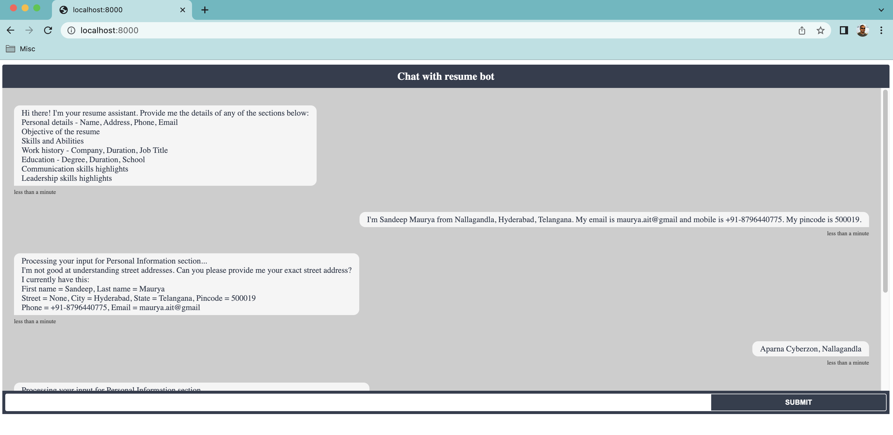

# Resume Assistant
A conversational chatbot to fill resume data.

# How to build
```shell
rasa train -c <config-file>
```

# How to run locally

In different tabs
* Start action server
```shell
rasa run actions --port 5055
```
* Set ACTIONS_URL environment variable and start rasa server
```shell
export ACTIONS_URL=http://localhost:5055
python3 -m rasa run --enable-api --cors="*" --port 5005
```
* Set RASA_URL and start http server to serve webchat page
```shell
cd webchat
pip3 install Flask
export RASA_URL=http://localhost:5005
python3 -m flask run --host=0.0.0.0 --port=8000
```
* When all severs are up, browse to http://localhost:8000
  

# Deploying to Azure

* Resource Group: https://portal.azure.com/#@deshmukhsudarshangmail.onmicrosoft.com/resource/subscriptions/5c22948c-e4c8-4bc0-824a-4af5a122fc71/resourceGroups/Resume_chatbot/overview
* Get contributor access from Sudarshan.

## Connecting to container registry
* Get username and password of Container Registry from Azure portal.
* username: resumebotcr
* password: [Check Access Keys section of Azure Container Registry]
```shell
docker login resumebotcr.azurecr.io
```

## Deploy actions server
* Publish latest image
```shell
docker build -f Dockerfile_Action -t resumebot/actions .
docker tag resumebot/actions resumebotcr.azurecr.io/actions
docker push resumebotcr.azurecr.io/actions
```
* Restart action container instance to refresh the latest image
  

* Check logs
  

* When the actions server is ready, try below request. It should give 200 OK response.
```shell
curl --location --request POST 'http://actions.gacqgcdsdubadkbn.southindia.azurecontainer.io:8080/webhook' \
--header 'Content-Type: text/plain' \
--data-raw '{}' -w "\nhttp_code: %{http_code}\\n"
```
## Deploy rasa server
* Train the model
* Keep just the latest model, delete all older ones to keep image small
* Push to container registry
```shell
docker build -t resumebot/rasa .
docker tag resumebot/rasa resumebotcr.azurecr.io/rasa
docker push resumebotcr.azurecr.io/rasa
```
* Restart rasa container instance
* Loading model takes some time. Check container logs. When rasa server is up, try below request
```shell
curl --location --request POST 'rasa-server.bzbwhpehdfbqduhb.southindia.azurecontainer.io:8080/model/parse' \
--header 'Content-Type: text/plain' \
--data-raw '{
    "text": "hi"
}'
```

## Deploy webchat server
* Push image
```shell
cd webchat
docker build -f Dockerfile_Webchat -t resumebot/webchat .
docker tag resumebot/webchat resumebotcr.azurecr.io/webchat
docker push resumebotcr.azurecr.io/webchat
```
* Restart webchat server
* Check logs, wait for server to start and then try http://webchat.h6aabqg6h7eue9d4.southindia.azurecontainer.io/
  

# Sample chat transcript
```shell
Your input ->  hi                                                                                                                                                                                                 
Hi there! I'm your resume assistant. Provide me the details of any of the sections below:
 Personal details - Name, Address, Phone, Email
 Objective of the resume
 Skills and Abilities
 Work history - Company, Duration, Job Title
 Education - Degree, Duration, School
 Communication languages 
 Leadership skills highlights

Your input ->  I'm Sandeep Maurya from Nallagandla, Hyderabad, Telangana. My email is maurya.ait@gmail and mobile is +91-8796440775. My pincode is 500019.                                                        
Processing your input for Personal Information section...
I'm not good at understanding street addresses. Can you please provide me your exact street address?
I currently have this:
First name = Sandeep, Last name = Maurya
Street = None, City = Hyderabad, State = Telangana, Pincode = 500019
Phone = +91-8796440775, Email = maurya.ait@gmail

Your input ->  Aparna Cyberzon, Nallagandla                                                                                                                                                                       
Processing your input for Personal Information section...
Your personal information is complete.
I currently have this:
First name = Sandeep, Last name = Maurya
Street = Aparna Cyberzon, Nallagandla, City = Hyderabad, State = Telangana, Pincode = 500019
Phone = +91-8796440775, Email = maurya.ait@gmail
 
------
Continue providing info about any of the sections below:
An Objective for your resume
Work history - Companies you worked at, duration and job titles (one company at a time).
Education history - Degrees, duration and Location (one degree at a time).
Leadership highlights - Highlight instances where you showed leadership skills (one highlight at a time)
Skills and Abilities
Communication Languages

Your input ->  IT professional with good experience in various roles, domains and technologies.                                                                                                                   
Processing your input for Objective section...
Your Objective information is complete.
I currently have this:
Objective: IT professional with good experience in various roles, domains and technologies. 
------
Continue providing info about any of the sections below:
Work history - Companies you worked at, duration and job titles (one company at a time).
Education history - Degrees, duration and Location (one degree at a time).
Leadership highlights - Highlight instances where you showed leadership skills (one highlight at a time)
Skills and Abilities
Communication Languages

Your input ->  I worked at Persistent as a Tech Lead. Worked from 2004 to 2012.                                                                                                                                   
Processing your input for Work History section...
Continue providing additional/missing work history (one company at a time). Just say Done when you are done with all companies.
I currently have this:
Company: Persistent From: 2004 To: 2012 Job Title: Tech Lead

Your input ->  Then at Icertis from 2012 to 2016 as a Technical Architect.                                                                                                                                      
Processing your input for Work History section...
Continue providing additional/missing work history (one company at a time). Just say Done when you are done with all companies.
I currently have this:
Company: Persistent From: 2004 To: 2012 Job Title: Tech Lead
Company: Icertis From: 2012 To:  Job Title: Technical Architect

Your input ->  Worked at Icertis till 2016                                                                                                                                                                        
Processing your input for Work History section...
Continue providing additional/missing work history (one company at a time). Just say Done when you are done with all companies.
I currently have this:
Company: Persistent From: 2004 To: 2012 Job Title: Tech Lead
Company: Icertis From: 2012 To: 2016 Job Title: Technical Architect

Your input ->  That's it                                                                                                                                                                                          
Processing your input for Work History section...
Your work history information is complete.
I currently have this:
Company: Persistent From: 2004 To: 2012 Job Title: Tech Lead
Company: Icertis From: 2012 To: 2016 Job Title: Technical Architect
 
------
Continue providing info about any of the sections below:
Education history - Degrees, duration and Location (one degree at a time).
Leadership highlights - Highlight instances where you showed leadership skills (one highlight at a time)
Skills and Abilities
Communication Languages

Your input ->  I did my BE Computers from Savitribai Phule Pune University from 2000 to 2004. It is in Pune                                                                                                       
Processing your input for Education section...
Continue providing additional/missing Education history (one degree at a time). Just say Done when you are done with all degrees.
I currently have this:
Degree: BE From: 2000 To:  School: Savitribai Phule Pune University Location: Pune

Your input ->  Completed my BE computers in 2004                                                                                                                                                                  
Processing your input for Education section...
Continue providing additional/missing Education history (one degree at a time). Just say Done when you are done with all degrees.
I currently have this:
Degree: BE From: 2000 To: 2004 School: Savitribai Phule Pune University Location: Pune

Your input ->  Did my MS from BITS Pilani during 2012 to 2014 in Pilani. MS was completed in 2014                                                                                                                 
Processing your input for Education section...
Continue providing additional/missing Education history (one degree at a time). Just say Done when you are done with all degrees.
I currently have this:
Degree: BE From: 2000 To: 2004 School: Savitribai Phule Pune University Location: Pune
Degree: MS From: 2012 To: 2014 School: BITS Pilani Location: Pilani

Your input ->  Done                                                                                                                                                                                               
Processing your input for Education section...
Your Education history information is complete.
I currently have this:
Degree: BE From: 2000 To: 2004 School: Savitribai Phule Pune University Location: Pune
Degree: MS From: 2012 To: 2014 School: BITS Pilani Location: Pilani
 
------
Continue providing info about any of the sections below:
Leadership highlights - Highlight instances where you showed leadership skills (one highlight at a time)
Skills and Abilities
Communication Languages

Your input ->  I led a team of 3 members for Enduro triathlon                                                                                                                                                     
Processing your input for Leadership section...
Continue providing additional highlights (one at a time). Just say Done when you are done with all highlights.
I currently have this:
1: I led a team of 3 members for Enduro triathlon

Your input ->  Secretary of my society                                                                                                                                                                            
Processing your input for Leadership section...
Continue providing additional highlights (one at a time). Just say Done when you are done with all highlights.
I currently have this:
1: I led a team of 3 members for Enduro triathlon
2: Secretary of my society

Your input ->  Done                                                                                                                                                                                               
Processing your input for Leadership section...
Completed your leadership highlights.
I currently have this:
1: I led a team of 3 members for Enduro triathlon
2: Secretary of my society
 
------
Continue providing info about any of the sections below:
Skills and Abilities
Communication Languages

Your input ->  Java, .NET, Azure                                                                                                                                                                                  
Your Skills information is complete.
I currently have this:
Skills = Java, .NET, Azure 
------
Continue providing info about any of the sections below:
Communication Languages

Your input ->  English, Hindi                                                                                                                                                                                     
Your Communication information is complete.
I currently have this:
Communication = English, Hindi
-------------------
** I got everything for your resume. Thank you. See you next time. Bye. **

```
